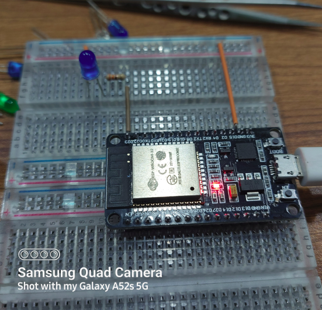
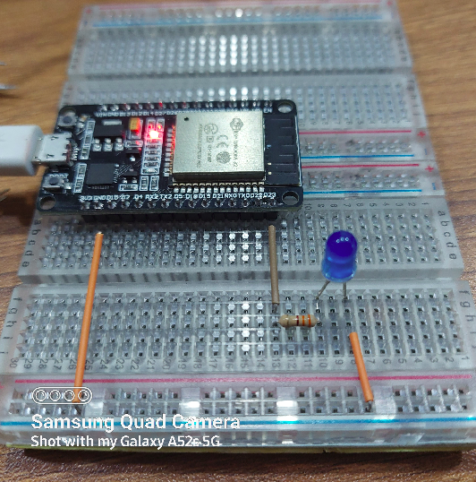

<h2>Documentation</h2>

The blinking LED project in the embedded system is like hello-world in other programming languages.

<h3>Overview</h3>

The experiment we'll build consists of simply blinking a led with ESP32 NodeMCU development board. We use GPIO 23 of ESP32 Board for connecting the LED.  The blinking LED project works as follows: 
<ol>
<li>The LED turns on for 1 second</li>
<li>The LED turns off for 1 second</li>
<li>The LED turns on again for 1 second</li>
<li>The LED turns off again for 1 second</li>
<li>This will continues until you tell the program to stop.</li>
</ol>

<h3>Component Use:</h3>

<ol>
<li>ESP32</li>
<li>330 Ohm resistor</li>
<li>a LED</li>
<li>Connecting Wire</li>
<li>Thonny IDE (I am using Ubuntu 20.04)</li>
</ol>

<h3>[Code & Schematic Diagram]</h3>

youtube link: https://www.youtube.com/watch?v=ehXl_3F0aB8

 
