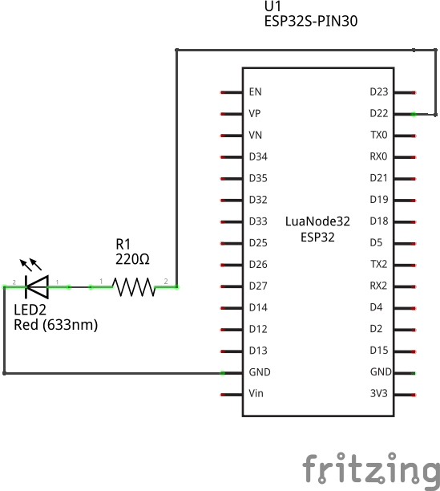
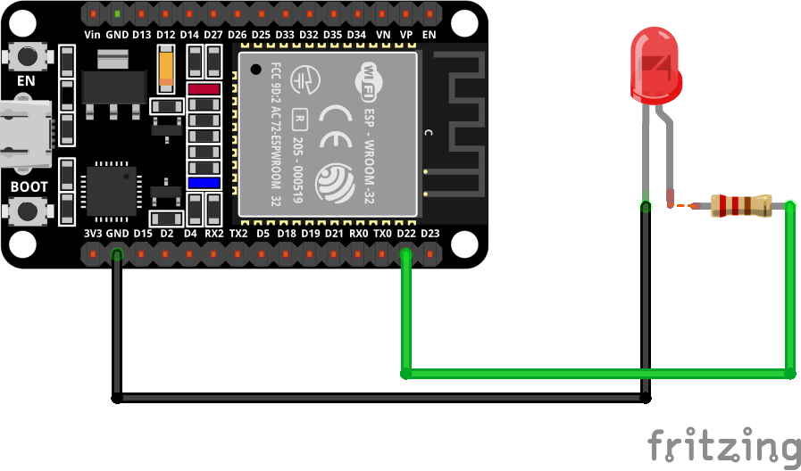
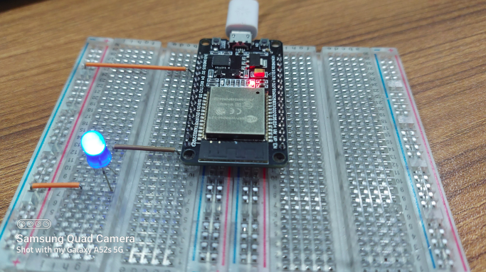
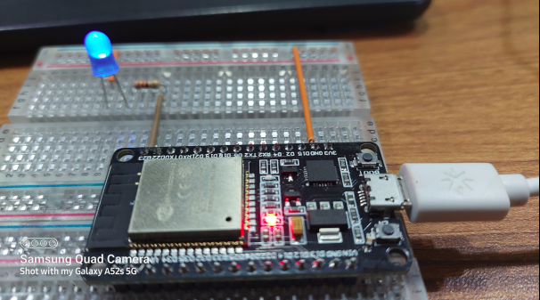
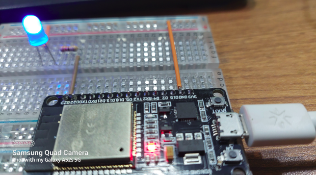

<h2>LED Fading</h2>

In this experiment, you'll learn how to dim an LED using PWM.

<h3>Overview</h3>

The ESP32 board will give us output 0V or 3.3V, but they can't output any voltages. But we can output mid-level volatages using pulse-width modulation(PWM).   The previous episod we simple expermiment a blink project which is only 0V when led off and 3.3V when led On. But in this experiment we produce a varying levels of voltages which creates a beautiful LED Dimmer. 
<ol>
<li>The LED turns on slowly with 100ms interval</li>
<li>The LED turns on fully</li>
<li>The LED turns off slowly with same interva </li>
<li>The LED turns off fully</li>
<li>This will continues until you tell the program to stop.</li>
</ol>

<h3>Component Use:</h3>

<ol>
<li>ESP32</li>
<li>330 Ohm resistor</li>
<li>a LED</li>
<li>Connecting Wire</li>
<li>Thonny IDE (I am using Ubuntu 20.04)</li>
</ol>

<h3>Pin Diagram-</h3>

<ol>
<li>Connect LED pin(big leg/Anode) to D23 pin of ESP32</li>
<li>Connect LED ground(small leg/Cathode) to GND of ESP32</li>
</ol>

<h3>Schematic Diagram</h3>

<h3>Breadboard Diagram</h3>

<h3>Experimental Images</h3>

<h3>Youtube: https://www.youtube.com/watch?v=ehXl_3F0aB8</h3>

