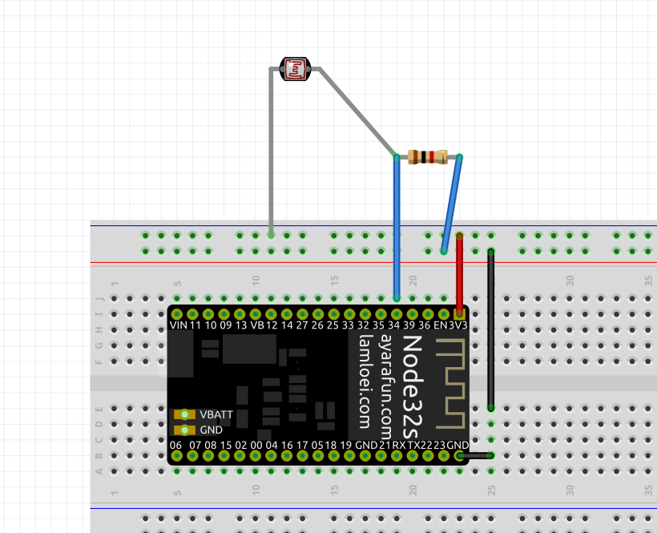
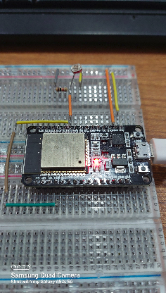
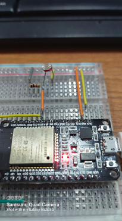
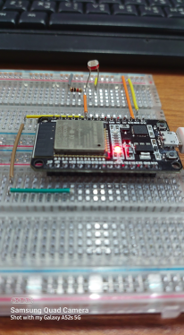

<h3>Description:</h3>

How to input analog value in Esp32 using micro python

<h4>Component use:</h4>

<ol>
<li>ESP32</li>
<li>LDR sensor</li>
<li>1 KΩ resistor</li>
<li>Breadboard</li>
<li>Connecting Wire</li>
<li>Micro-USB cable for uploading Code to ESP32</li>
<li>Thonny IDE install on pc</li>
</ol>

<h4>Pin Diagram  - </h4>

<ol>
<li> LDR any leg connect to 3.3V.</li>
<li> LDR other leg connect to a 1 KΩ resistor.</li>
<li> Connect the other resistor leg to ground.</li>
<li> Connect a connecting wire to ldr-resistor leg to D34 pin of ESP32.</li>
</ol>

