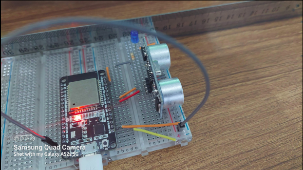

<h3>Description:</h3>

 Distance calculating using HC-SR04 ultrasonic sensor with ESP32 and Micro-Python

<h4>Component use:</h4>

<ol>
<li>ESP32</li>
<li>HC-SR04 Ultrasonic Sensor</li>
<li>Breadboard</li>
<li>Connecting Wire</li>
<li>Micro-USB cable for uploading Code to ESP32</li>
<li>Thonny IDE install on pc</li>
</ol>

<h4>Pin Configuration- </h4>

<ol>
<li> Connect HC-SR04 VCC pin to VIN pin of ESP32.</li>
<li> Connect HC-SR04 GND pin to GND pin of ESP32.</li>
<li> Connect HC-SR04 Trig pin to D5 pin of ESP32.</li>
<li> Connect HC-SR04 Echo pin to D18 pin of ESP32.</li>
</ol>

