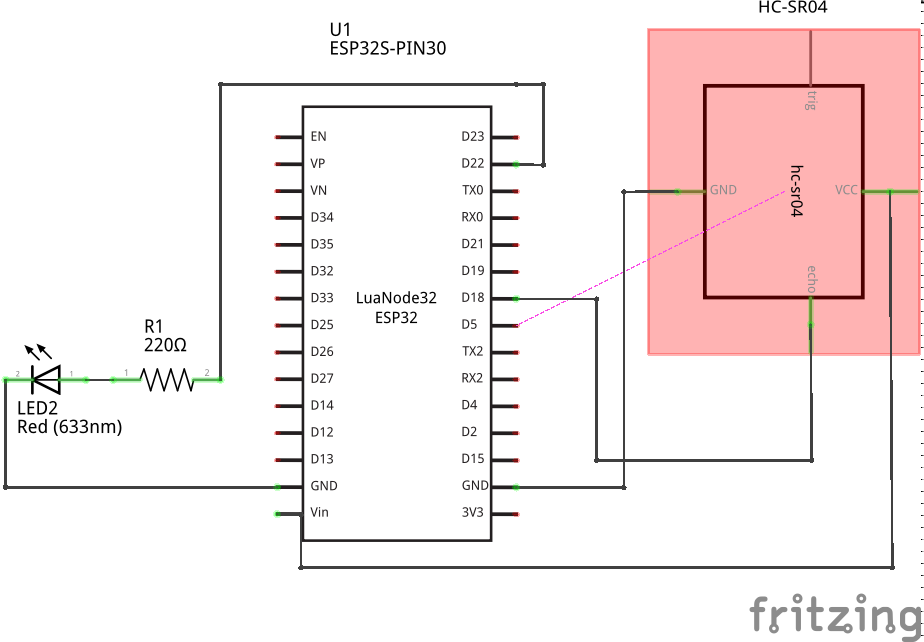
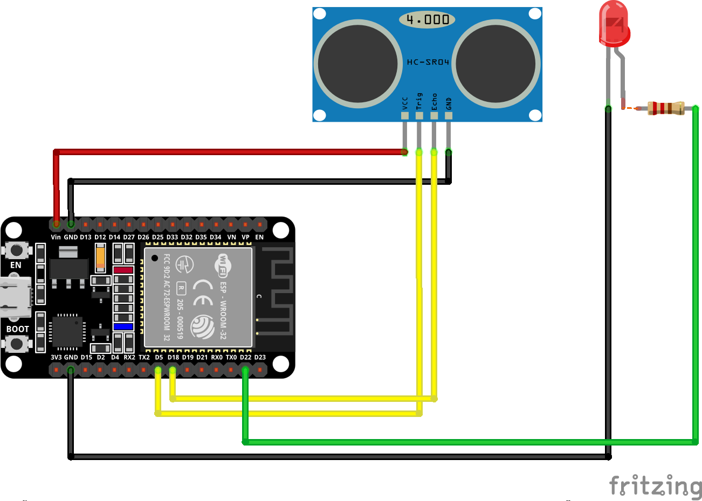
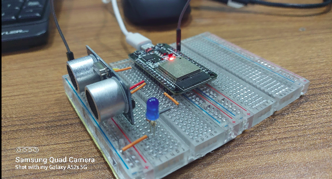
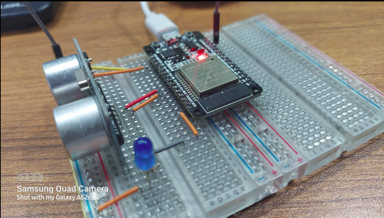
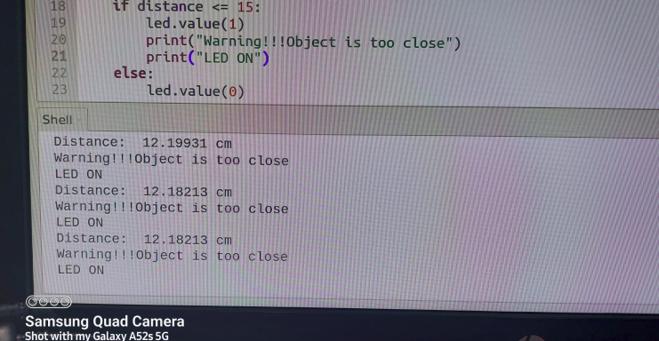

<h2>Documentation</h2>

This is a basic project named "blink led when you come closer". In this project we will measure distance using  
ultrasonic sensor.

<h3>Overview</h3>

The experiment we'll build consists of simply blinking a led when  
  a object comes below 15 cm with HC-SR04 Ultrasonic Sensor and ESP32 NodeMCU development board. 
  We will use micro-python language to problem our esp32 board. The "blink led when you come closer" project  
  works as follows: 
<ol>
<li>The LED turns on when the object comes below 15cm from the sensor</li>
<li>The LED turns off when the object upper than 15cm from the sensor</li>
<li>We also see the distance value in the serial monitor</li>
<li>This will continues until you tell the program to stop.</li>
</ol>

<h3>Component Use:</h3>

<ol>
<li>ESP32</li>
<li>HC-SR04 Ultrasonic Sensor</li>
<li>330 Ohm resistor</li>
<li>a LED</li>
<li>Connecting Wire</li>
<li>Thonny IDE (I am using Ubuntu 20.04)</li>
</ol>

<h3>Schematic Diagram</h3>

<h3>Breadboard Diagram</h3>

<h3>Experimental Images</h3>

