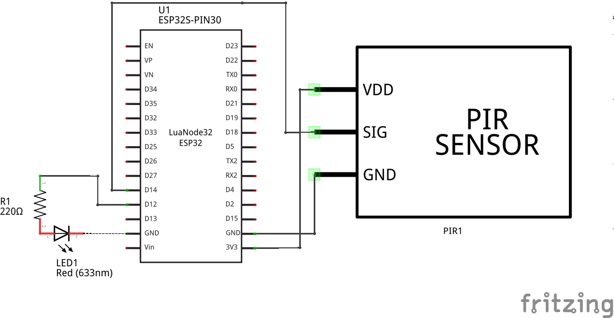
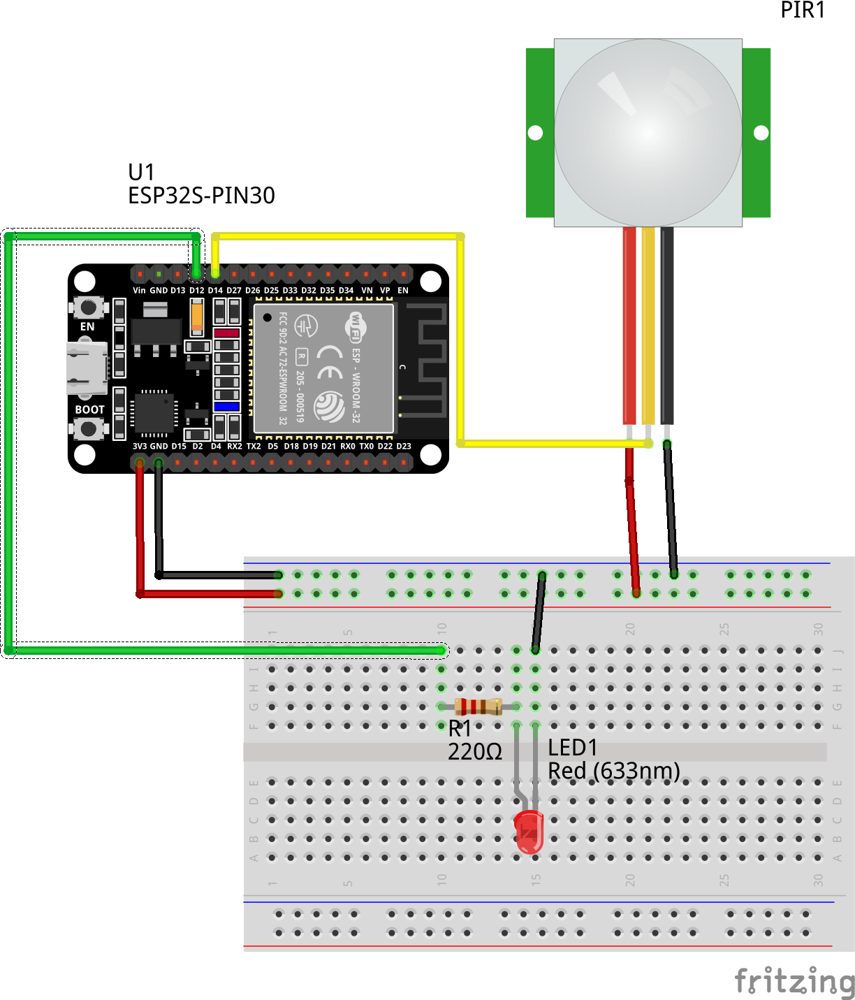
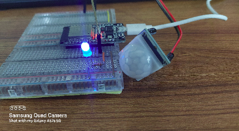
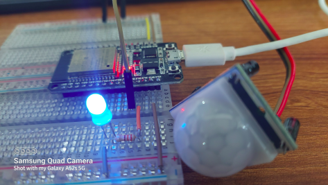
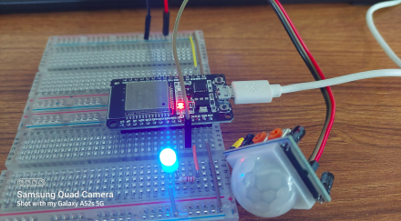

<h2>Interrupts</h2>

Interrupts is a feature of micro-controller/micro-processor and very useful for making things happen  
automatically in microcontroller programs. Easy defination - you don't need to constantly check the current pin value.  
WHen a change is detected, and event(a method/function is called) is triggered. When a interrupt happens, 
the cpu stops current jobs and execute the interrupt task and back to the main job after finished the task.

<h3>Example of Interrupt in MicroPython and ESP32</h3>

 We'll build a simple project with a PIR motion sensor and a led. So the task will be: 
<ol>
<li>When the motion is detected, the led will on for 20s</li>
<li>After 20s if there's no motion detected the led will turn off.</li>
<li>If motion detected again, we will light up the led again. </li>
<li>This will continues until you tell the program to stop.</li>
</ol>

<h3>Component Use:</h3>

<ol>
<li>ESP32</li>
<li>HC-SR501 Motion Sensor</li>
<li>220 Ohm resistor</li>
<li>a LED</li>
<li>Connecting Wire</li>
<li>Thonny IDE (I am using Ubuntu 20.04)</li>
<li>Breadboard</li>
</ol>

<h3>Pin Diagram-</h3>

<ol>
<li>Connect HC-SR501 VCC pin to 3.3V pin of ESP32</li>
<li>Connect HC-SR501 GND pin to GND pin of ESP32.</li>
<li>Connect HC-SR501 Data pin to D14 pin of ESP32.</li>
<li>Connect LED pin(big leg/Anode) to D12 pin of ESP32</li>
<li>Connect LED ground(small leg/Cathode) to GND of ESP32</li>
</ol>

<h3>Schematic Diagram</h3>

<h3>Breadboard Diagram</h3>

<h3>Experimental Images</h3>

<h3>Youtube</h3>
https://youtu.be/iodjIniKh1w
