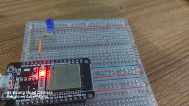

<h2>Deep Sleep</h2>

When a IoT project is powered by a wall adapter then you don't care too much about power consumption but  
it you're going to power your project from a battery, then every milli-amps counts. ESP32 draws around 75mA for  
normal operations and around 240mA when transmitting data over WiFi. So it could be a power hungry device. But esp32  
has a special feature called Deep Sleep. So What is deep sleep?

<h3>ESP32 Deep Sleep</h3>

In deep sleep mode, the CPUs most of the RAM and all digital peripherals are powered off. 
The only parts of the chip that remain operational are:
<ul>
    <li>ULP Coprocessor</li>
    <li>RTC Controller</li>
    <li>RTC Peripherals</li>
    <li>RTC Fast and slow memory</li>
  </ul>

The chip consumes around 0.15 mA (if the ULP coprocessor is on) to 10µA.

<h3>Example of deep sleep in MicroPython and ESP32</h3>

 We'll build a simple project of deep sleep with a led. So the tasks will be: 
<ol>
<li>The LED will turn ON for 1s</li>
<li>the LED will  turn OFF for 1s</li>
<li>Wait for 5s-(it is for testing perpose when the code is finalized then remove the delay)</li>
<li>Going to deep sleep for 10s</li>
<li>Wake-up and do job again</li>
</ol>

<h3>Component Use:</h3>

<ol>
<li>ESP32</li>
<li>220 Ohm resistor</li>
<li>a LED</li>
<li>Connecting Wire</li>
<li>Thonny IDE (I am using Ubuntu 20.04)</li>
<li>Breadboard</li>
</ol>

<h3>Pin Diagram-</h3>

<ol>
<li>Connect LED pin(big leg/Anode) to D12 pin of ESP32</li>
<li>Connect LED ground(small leg/Cathode) to GND of ESP32</li>
</ol>

<h3>Schematic Diagram</h3>

<h3>Breadboard Diagram</h3>

<h3>Experimental Images</h3>

<h3>Youtube Link:https://www.youtube.com/watch?v=jGnYGBT45BE</h3>

